# Mermaid drafting examples

These sources intentionally omit hand-written theme directives. The renderer applies the default Cursor paper theme. Pass `--theme aurora` for the old vivid poster look, or `--theme docs`, `minimal`, or `neutral` for the other palettes.

## Process with a decision

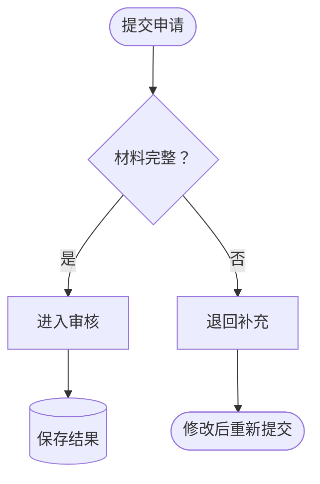

## Layered architecture

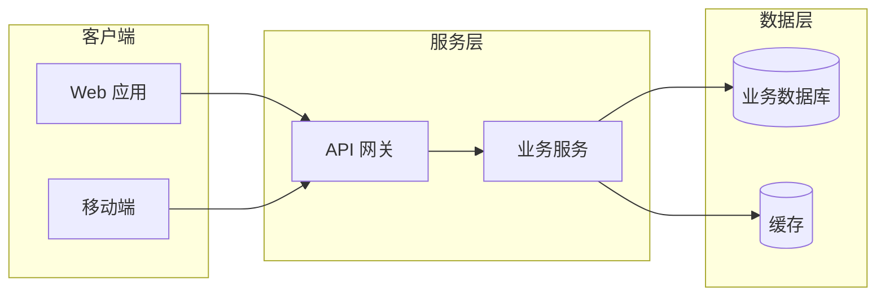

## Sequence

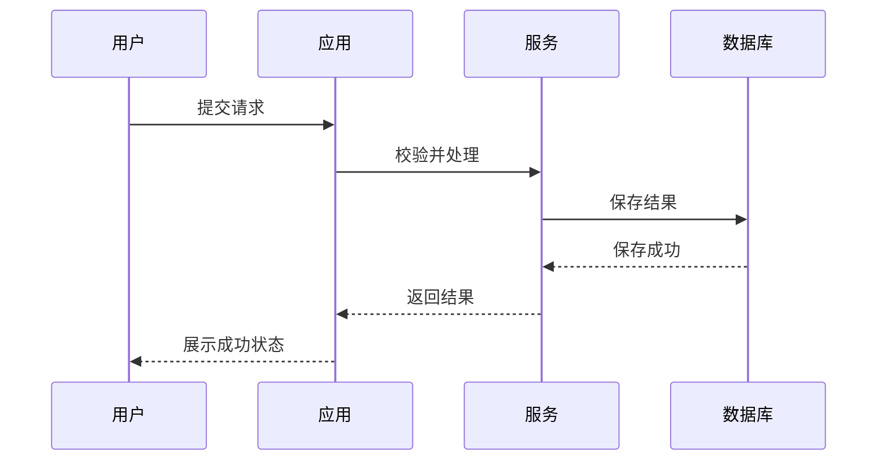

## State lifecycle

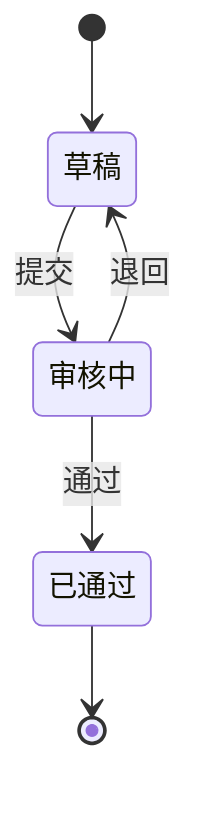

## Class overview

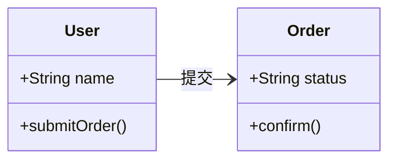

## Entity relationship

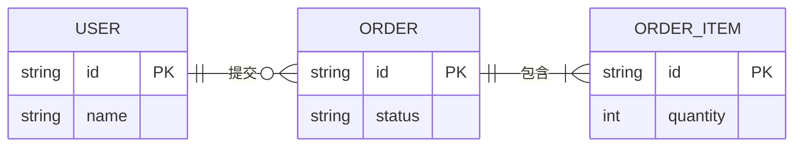

## Mindmap

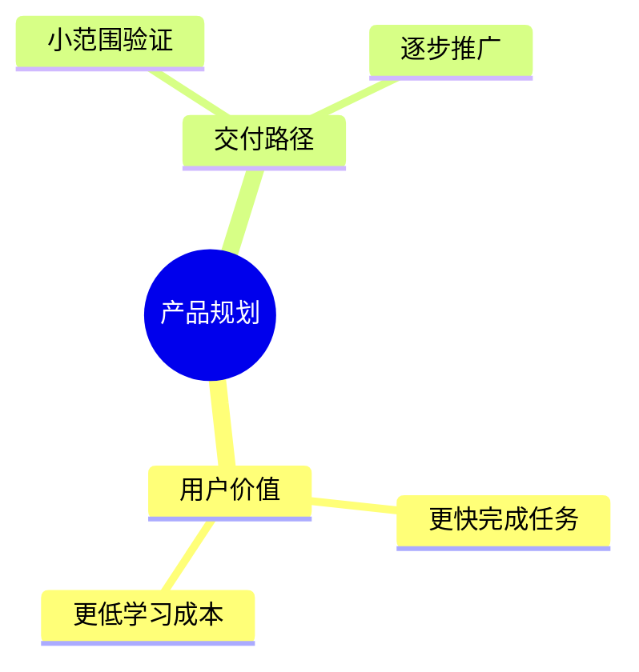

## Timeline

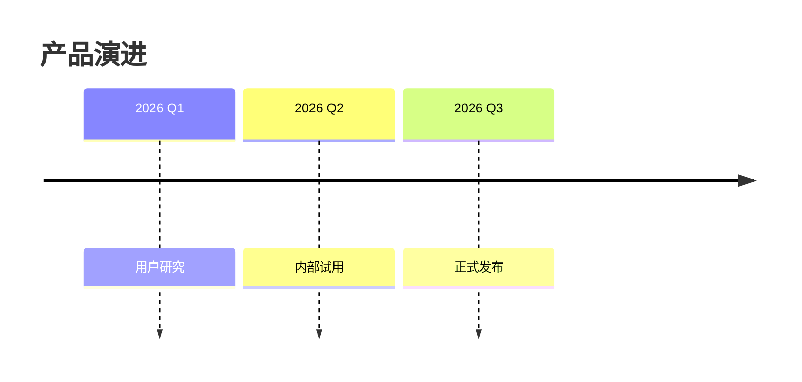

## Gantt

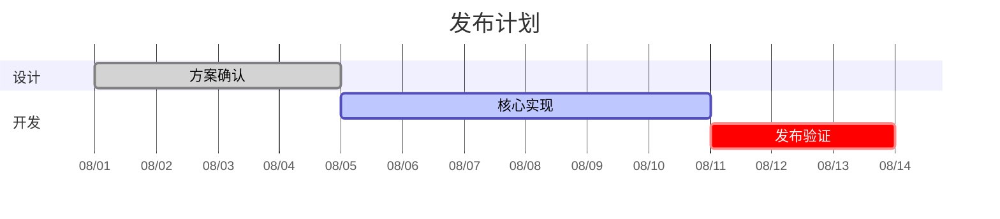

## Git history

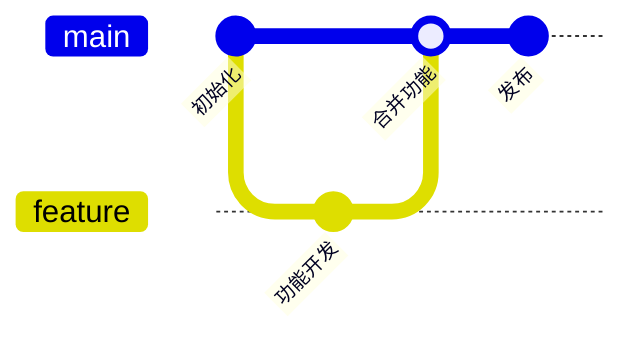

## User journey

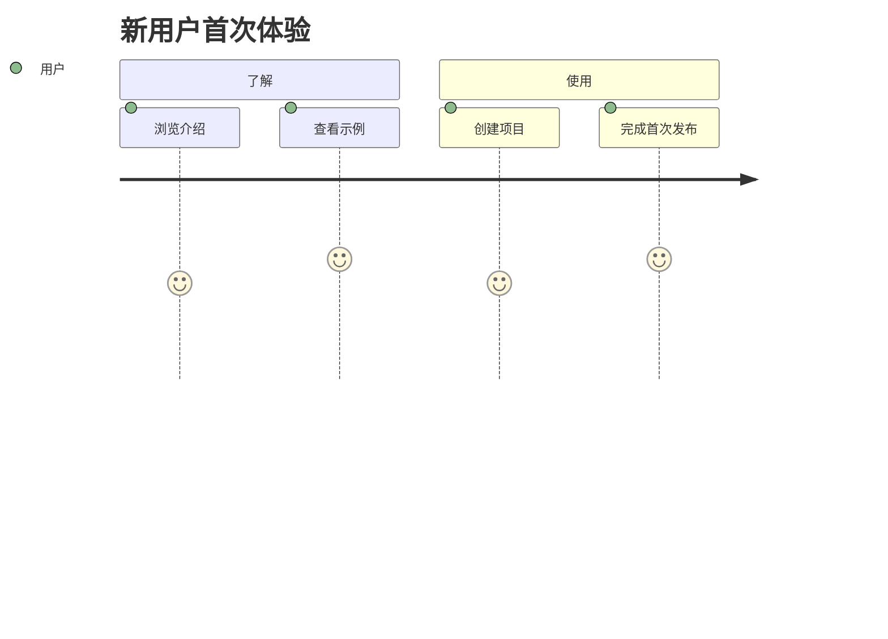

## Pie composition

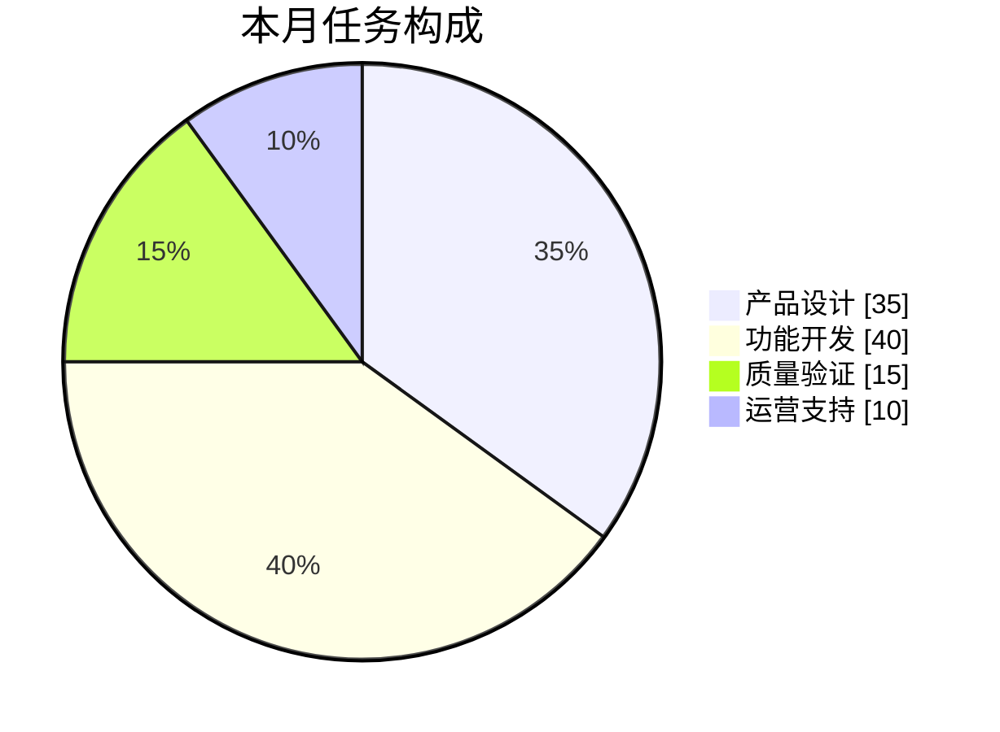

## Quadrant prioritization

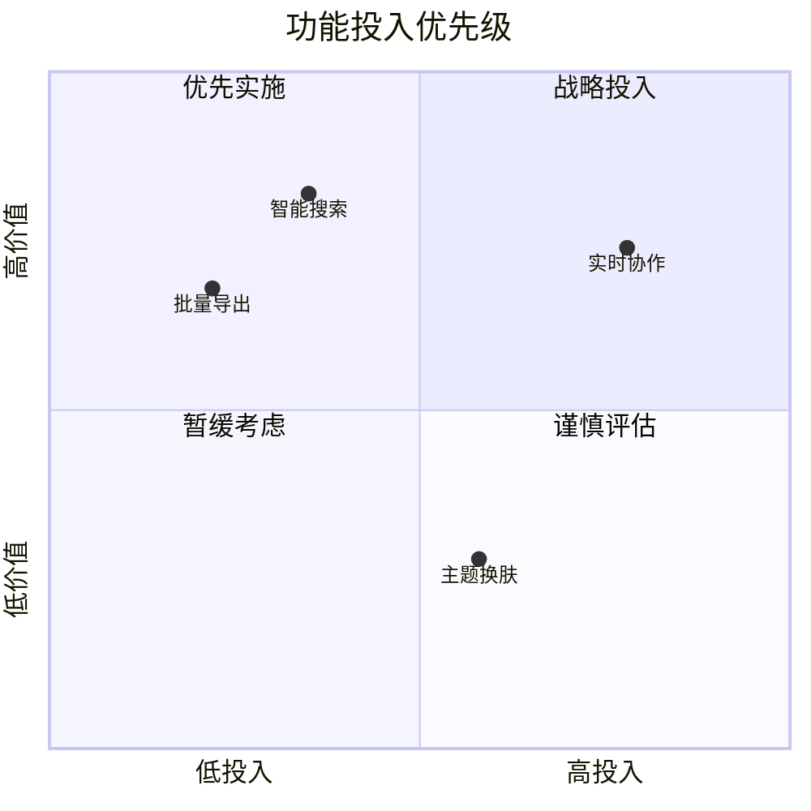

## Native architecture without external icons

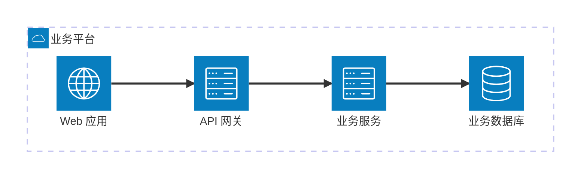

## Controlled block layout

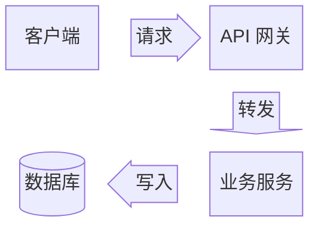

## Kanban snapshot

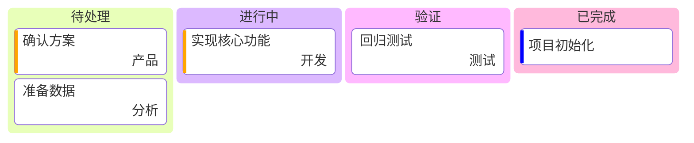

## Sankey flow

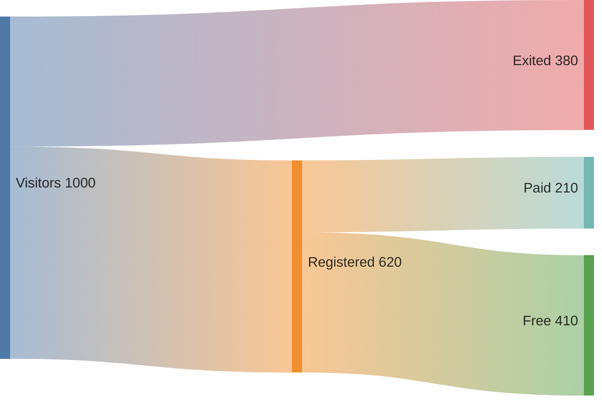

## XY bar and line

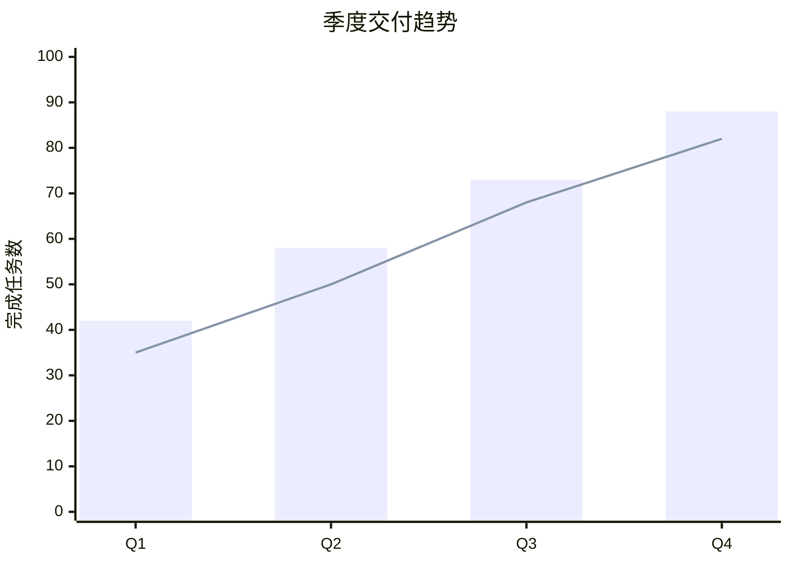

## Crowded source repair

When a node contains implementation detail such as `upsert user_question_answer and update grading_status`, shorten the node to `保存批改结果`. Put table names and field changes in the accompanying text. If an overview still exceeds roughly 10 nodes, create a second detail diagram instead of shrinking text.
